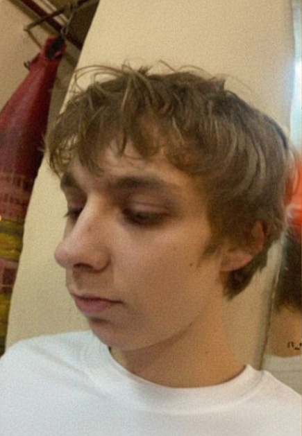

 Curriculum Vitae

# Curriculum Vitae

[About](#about) | [Skills](#skills) | [Projects](#projects)

## Photo



## Full Name

**Shcherbin Pankratij**

## Contact Information

Phone:  
+375-44-540-37-78

Email: [pankratijpochta@gmail.com](mailto:pankratijpochta@gmail.com)
## About Me

My name is Pankratij. In 2024, I entered the BRU, group - PMR-241. I've always liked mathematics. Now I only want to develop as a mathematician and as a programmer.

## Skills

*   Programming Languages: Python
*   Tools: Pycharm, VS

## Code Example
```Python
    #Bubblesort
    mylist = \[64, 34, 25, 12, 22, 11, 90, 5\]

    n = len(mylist)
    for i in range(n-1):
        for j in range(n-i-1):
            if mylist\[j\] > mylist\[j+1\]:
                mylist\[j\], mylist\[j+1\] = mylist\[j+1\], mylist\[j\]
        
    print(mylist)
```
    

## Projects

###   CV

My first project is my own CV

Technologies used: HTML

link: [View Project](file:///C:/Users/Admin/Desktop/%D0%A9%D0%B5%D0%B1%D0%B8%D0%BD/CV%20%D0%A9%D0%B5%D1%80%D0%B1%D0%B8%D0%BD.html)

## English level

*   Level: B2
*   Experience: English practice from studying

© 2026 Pankratij
